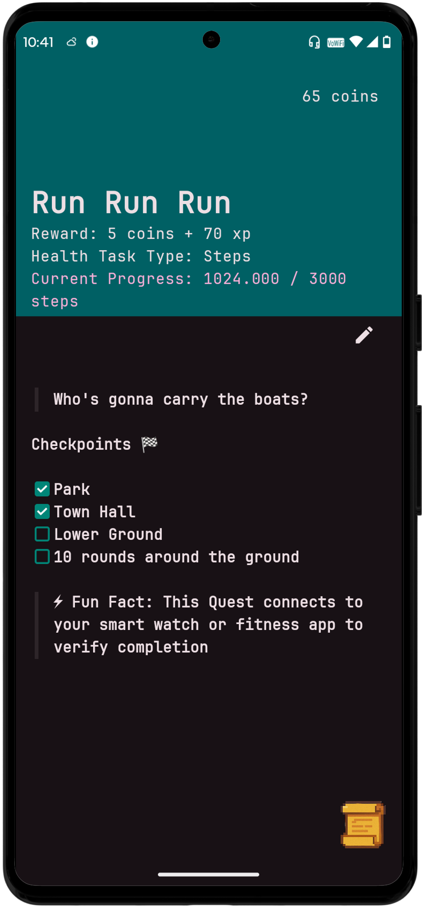
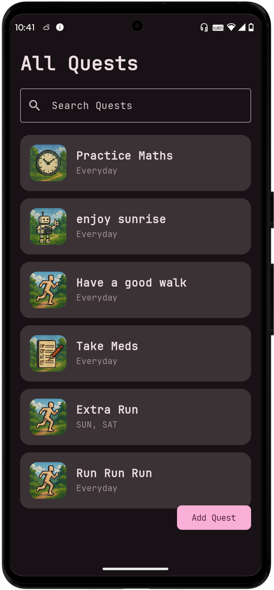
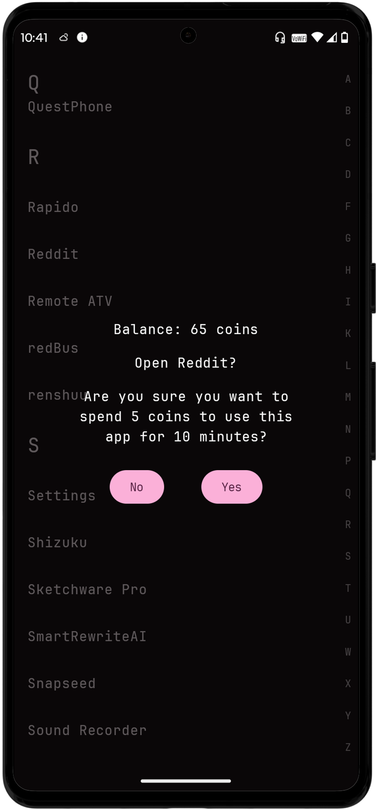
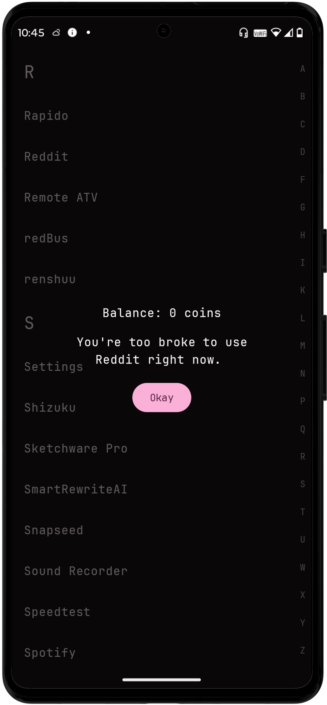
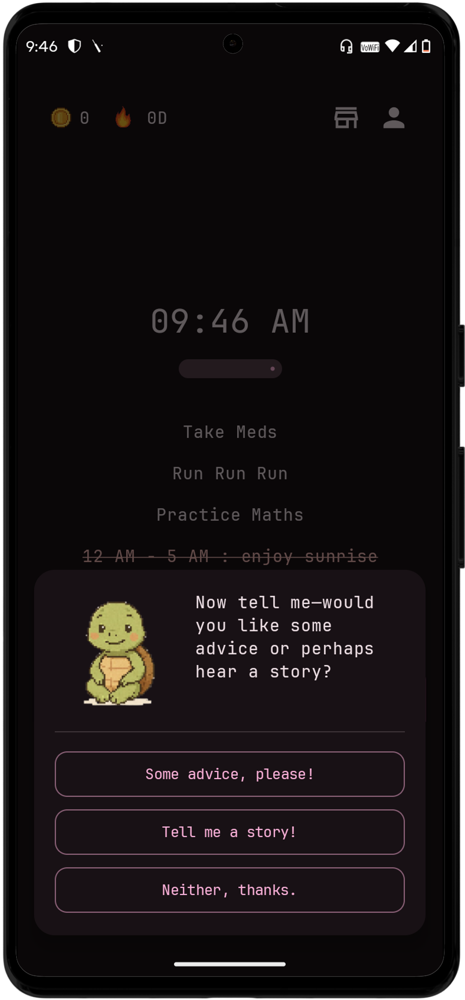
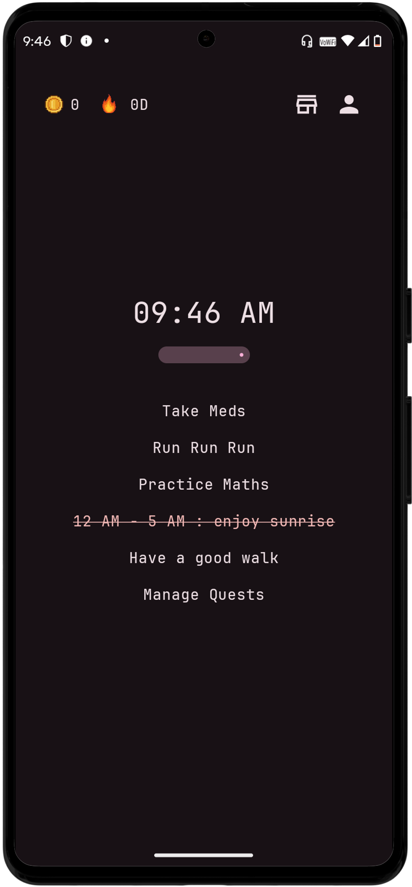
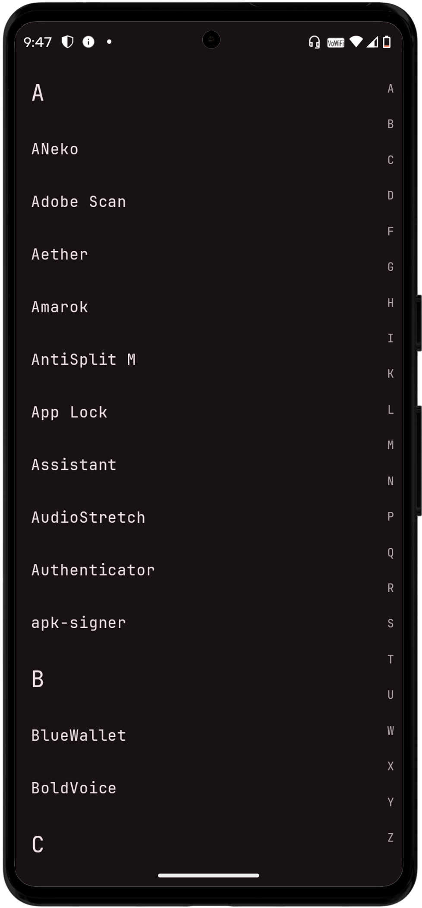
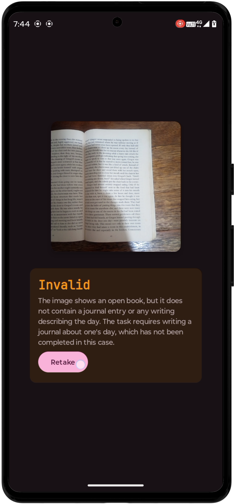

<div align="center">
  
  <h2>QuestPhone</h2>

  <a href="https://github.com/questphone/questphone/graphs/contributors">
    
  </a>
  <a href="https://discord.gg/RGuqaMHxAw">
    
  </a>
  <a href="https://github.com/questphone/questphone/releases">
    
  </a>
  <a href="https://github.com/questphone/questphone">
    
  </a>
</div>

---

**QuestPhone** is an open-source Android productivity utility designed to help users reduce screen addiction by regulating app usage through a gamified experience. The application blocks distracting apps and unlocks them only once the user completes all their work.

It was started in April 2024 under the name *DigipawFull* and is now continued as *QuestPhone*.

> [!CAUTION]
> This project is experimental and not yet ready for full production. [Donate](https://digipaws.life/donate)


> [!CAUTION]
> This is a continuation of the [DigipawsFull Project](github.com/nethical6/digipaws)
---

## 🚀 Features

- **Open Source**: Fully transparent, with the source code available for community contributions.
- **Productivity Enhancement**: Helps build healthier digital habits and reduce screen addiction.
- **Gamified**: Level up, make streaks, collect objects, earn rewards, and more.
- **Minimal Launcher**: Optional launcher that turns your device into a productivity beast.
- **Unlimited Possibilities**: Almost any real-life habit can be converted into a quest.
- **Strict Checking**: Not just checkboxes—uses integrations to verify your quests.

---

## 📸 Screenshots

Click on any image to enlarge.

<table>
  <tr>
    <td></td>
    <td></td>
    <td></td>
    <td></td>
    <td></td>
    <td></td>
    <td></td>
    <td></td>
  </tr>
</table>

---

## 🔌 Integrations

Integrations are how your quests get verified.

- **Health Connect**: Connects to your fitness watch or reads data from other apps.
- **AI Snap**: Prompts users to snap a photo after completing the task.
- **Deep Focus**: Blocks all but selected apps for focused time.
- **Swift Mark**: Simple tap-to-complete mode with no strict verification.

---

## 📝 Todo

- [ ] Add an API for other developers to turn their apps into quests.
- [ ] Add friends and social features.
- [ ] AI-generated motivational reminders.

---

## 🤝 Contributing

We welcome contributions from the community!

1. Fork the repository.
2. Create a new branch:
   ```sh
   git checkout -b feature/your-feature-name
